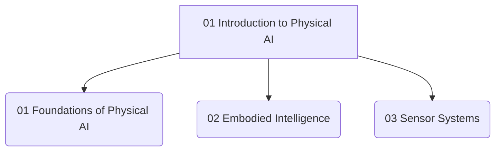

# 01 Introduction to Physical AI

 <!-- Replace with actual image link -->

Welcome to **Module 01: Introduction to Physical AI**! This module lays the groundwork for understanding how artificial intelligence can manifest in the physical world through robotics. We will explore the fundamental concepts that bridge the gap between abstract AI algorithms and their tangible embodiment in machines. From the foundational principles of Physical AI to the intricate role of embodied intelligence and the essential sensor systems that enable robots to perceive their environment, this module sets the stage for our journey into humanoid robotics.

## Module Overview

This module covers:

*   **Foundations of Physical AI**: What is Physical AI? Its core components and significance.
*   **Embodied Intelligence**: How a robot's physical form and interaction with the environment shape its intelligence.
*   **Sensor Systems**: The array of sensors that enable robots to perceive and interact with the physical world.

## Module Structure

## Dive into the Lessons:

*   [Lesson 01: Foundations of Physical AI](./01-foundations-of-physical-ai)
*   [Lesson 02: Embodied Intelligence](./02-embodied-intelligence)
*   [Lesson 03: Sensor Systems](./03-sensor-systems)
