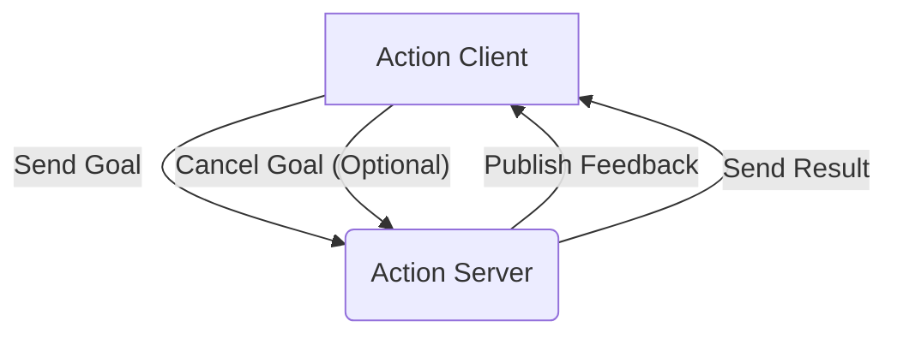

# 03 ROS 2 Actions and Parameters

## 💡 Theory

Beyond topics and services, ROS 2 provides **actions** for long-running, goal-oriented tasks that require continuous feedback and the ability to be preempted. An action client sends a goal to an action server, which then provides continuous feedback on the goal's progress and ultimately a result. This pattern is essential for complex robot behaviors like navigating to a specific location, picking up an object, or performing a lengthy manipulation sequence, where the robot needs to constantly monitor its progress and potentially adjust its plan. ROS 2 also incorporates a robust **parameter system**, allowing nodes to expose configurable values at runtime. Parameters enable dynamic adjustment of robot behavior without recompiling code, which is invaluable for fine-tuning algorithms, switching operational modes, or adapting to changing environmental conditions. Parameters can be read, set, and listed programmatically or via command-line tools.

### ROS 2 Actions: Structure and Flow



```python
# File: ros2_simple_action_client.py
import rclpy
from rclpy.action import ActionClient
from rclpy.node import Node
from example_interfaces.action import Fibonacci # Standard ROS 2 action example

class FibonacciActionClient(Node):

    def __init__(self):
        super().__init__('fibonacci_action_client')
        self._action_client = ActionClient(self, Fibonacci, 'fibonacci')
        self.get_logger().info('FibonacciActionClient node started.')

    def send_goal(self, order):
        goal_msg = Fibonacci.Goal()
        goal_msg.order = order

        self.get_logger().info('Waiting for action server...')
        self._action_client.wait_for_server()

        self.get_logger().info(f'Sending goal with order {order}')
        self._send_goal_future = self._action_client.send_goal_async(goal_msg, feedback_callback=self.feedback_callback)

        self._send_goal_future.add_done_callback(self.goal_response_callback)

    def goal_response_callback(self, future):
        goal_handle = future.result()
        if not goal_handle.accepted:
            self.get_logger().info('Goal rejected :(')
            return

        self.get_logger().info('Goal accepted :)')

        self._get_result_future = goal_handle.get_result_async()

        self._get_result_future.add_done_callback(self.get_result_callback)

    def get_result_callback(self, future):
        result = future.result().result
        self.get_logger().info(f'Result: {list(result.sequence)}')
        rclpy.shutdown()

    def feedback_callback(self, feedback_msg):
        feedback = feedback_msg.feedback
        self.get_logger().info(f'Received feedback: {list(feedback.sequence)}')

def main(args=None):
    rclpy.init(args=args)

    action_client = FibonacciActionClient()

    action_client.send_goal(10) # Request Fibonacci sequence of order 10

    rclpy.spin(action_client)


if __name__ == '__main__':
    # To run, you would also need a Fibonacci Action Server running.
    # Example server: https://docs.ros.org/en/iron/Tutorials/Beginner-CLI-Tools/Writing-A-Simple-Cpp-Action-Server-And-Client.html
    # This client code needs a compatible server to connect to.
    print("ROS 2 Action Client example. Requires a Fibonacci Action Server to be running.")
```

## 🎓 Key Insight

Effective parameter management and action planning are vital for creating adaptable and robust humanoid robots. Parameters allow for runtime flexibility, enabling operators or higher-level AI systems to adjust a robot's behavior without downtime. For example, a robot's navigation node might have a 'speed_limit' parameter that can be changed to make it move slower in crowded environments. Actions provide a structured way to execute complex, multi-step tasks that require ongoing supervision and feedback. Without actions, achieving behaviors like 'walk to the kitchen' would involve intricate coordination of many topics and services, making the system brittle. The combination of actions for goal execution and parameters for dynamic configuration empowers robots to perform sophisticated tasks in diverse, unpredictable real-world settings.

### ROS 2 Parameters: Key Operations

| Operation      | Description                                       | Command Line Example                      |
| :------------- | :------------------------------------------------ | :---------------------------------------- |
| **List**       | View all parameters on a node                     | `ros2 param list /my_robot_node`          |
| **Get**        | Retrieve the value of a specific parameter        | `ros2 param get /my_robot_node speed_limit` |
| **Set**        | Change the value of a parameter at runtime        | `ros2 param set /my_robot_node speed_limit 0.5` |

```python
# File: ros2_parameter_example.py
import rclpy
from rclpy.node import Node

class ConfigurableNode(Node):
    def __init__(self):
        super().__init__('configurable_node')
        self.declare_parameter('speed_limit', 1.0) # Declare a parameter with a default value
        self.declare_parameter('debug_mode', False)
        self.timer = self.create_timer(1.0, self.timer_callback)
        self.get_logger().info('ConfigurableNode node started.')

    def timer_callback(self):
        speed_limit = self.get_parameter('speed_limit').get_parameter_value().double_value
        debug_mode = self.get_parameter('debug_mode').get_parameter_value().bool_value

        self.get_logger().info(f'Current speed_limit: {speed_limit:.2f}, Debug mode: {debug_mode}')
        # Here, the robot's movement logic would use speed_limit
        # And debug_mode might enable/disable verbose logging

def main(args=None):
    rclpy.init(args=args)
    node = ConfigurableNode()
    try:
        rclpy.spin(node)
    except KeyboardInterrupt:
        pass
    node.destroy_node()
    rclpy.shutdown()

if __name__ == '__main__':
    # To run:
    # 1. Start the node: ros2 run <package_name> configurable_node
    # 2. In another terminal, get/set parameters:
    #    ros2 param get /configurable_node speed_limit
    #    ros2 param set /configurable_node speed_limit 0.75
    #    ros2 param set /configurable_node debug_mode True
    print("ROS 2 Parameter example. Run node and use `ros2 param` commands in separate terminals.")
```

## 💬 Practice Exercise: "Ask your AI"

Imagine a humanoid robot is tasked with autonomously recharging its battery when low. Describe how you would use a ROS 2 action for the entire recharging process (navigate to charging station, align, connect, wait, disconnect, return). What parameters would be useful to configure this action (e.g., `charging_threshold`, `alignment_tolerance`)? How would the action server provide feedback during the process? Provide a hypothetical `curl` command to the `/ros2-actions-parameters` endpoint that reports the current status of a robot's action server and its exposed parameters.

```bash
# Live curl example for the FastAPI backend
# Assume FastAPI is running on http://localhost:8000
curl -X GET "http://localhost:8000/ros2-actions-parameters"
```

**Expected JSON Response (hypothetical, for ROS 2 actions and parameters status):**
```json
{
  "status": "ACTIVE",
  "robot_name": "Optimus-H1",
  "action_servers": [
    {
      "name": "/recharge_battery",
      "active_goals": 1,
      "last_goal_id": "UUID-CHARGE-001",
      "last_feedback": "ALIGNING_ROBOT",
      "last_result": "IN_PROGRESS"
    },
    {
      "name": "/pick_object",
      "active_goals": 0
    }
  ],
  "node_parameters": {
    "/navigation_node": {
      "speed_limit": 0.8,
      "obstacle_avoidance_enabled": true
    },
    "/recharge_battery": {
      "charging_threshold_percent": 20,
      "alignment_tolerance_m": 0.05
    }
  },
  "timestamp": "2025-12-05T16:50:00Z"
}
```