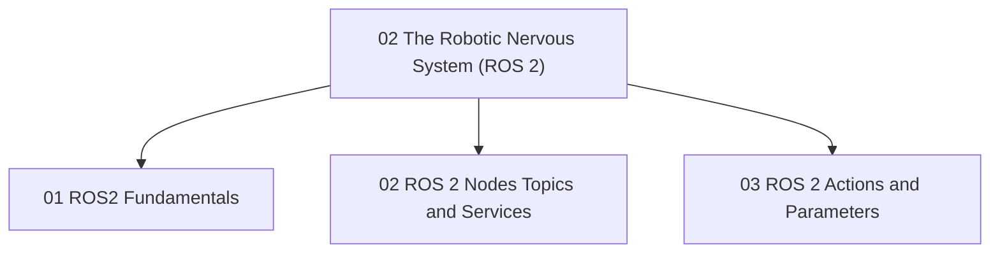

# 02 The Robotic Nervous System (ROS 2)

 <!-- Replace with actual image link -->

Welcome to **Module 02: The Robotic Nervous System (ROS 2)**! This module dives into the Robot Operating System 2 (ROS 2), the foundational middleware that empowers robots to communicate, process data, and execute commands. We will unravel the core concepts of ROS 2, understand its distributed architecture, and learn how to build robust robotic applications. From mastering nodes, topics, and services to implementing actions and managing parameters, this module provides the essential knowledge to program complex robotic behaviors.

## Module Overview

This module covers:

* **ROS 2 Fundamentals**: Introduction to ROS 2 concepts, environment setup.
* **ROS 2 Nodes, Topics, and Services**: Understanding the core communication mechanisms.
* **ROS 2 Actions and Parameters**: Implementing advanced robotic behaviors and configuration.

## Module Structure

## Dive into the Lessons

* [Lesson 01: ROS 2 Fundamentals](./01-ros2-fundamentals)
* [Lesson 02: ROS 2 Nodes, Topics, and Services](./02-ros2-nodes-topics-services)
* [Lesson 03: ROS 2 Actions and Parameters](./03-ros2-actions-parameters)
