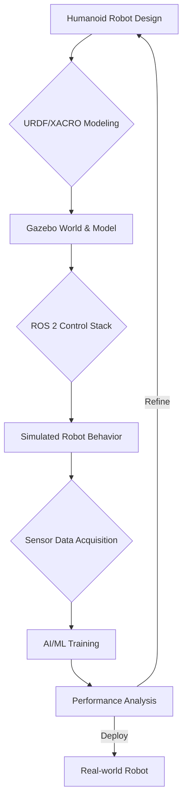

# 01 Gazebo Simulation for Humanoid Robotics

## 💡 Theory

**Gazebo** is a powerful 3D robotics simulator widely used in the ROS ecosystem. It allows developers to accurately simulate complex robot systems, environments, and sensor feedback in a virtual world. For humanoid robots, Gazebo is invaluable for:

1.  **Rapid Prototyping:** Test new designs and control algorithms without needing physical hardware.
2.  **Algorithm Development:** Develop and debug complex AI behaviors, motion planning, and navigation algorithms in a controlled environment.
3.  **Sensor Simulation:** Simulate various sensors (cameras, LiDAR, IMUs) to test perception algorithms.
4.  **Physics Accuracy:** Gazebo leverages robust physics engines (like ODE, Bullet, Simbody, DART) to provide realistic interactions, collisions, and dynamics.

While simple simulators might just render visuals, Gazebo provides a complete environment that interacts with ROS 2, allowing for direct application of robot control code developed for real hardware. This greatly reduces the gap between simulation and reality.

### Key Components of Gazebo

| Component       | Description                                                                                                                                                                                |
| :-------------- | :----------------------------------------------------------------------------------------------------------------------------------------------------------------------------------------- |
| **World Files** | Define the environment, including terrain, objects, lights, and sensors. Typically in `.world` XML format.                                                                                 |
| **Model Files** | Describe individual robots or objects with their visual (STL/DAE), collision, and inertial properties. Often referenced within world files.                                                  |
| **Physics Engine** | Handles realistic interactions, gravity, friction, and collisions. Configurable within world files.                                                                                          |
| **Plugins**     | Extend Gazebo's functionality, allowing interaction with ROS 2, custom sensor models, and specialized control interfaces.                                                                   |
| **GUI**         | Provides a visual interface to interact with the simulation, spawn models, inspect properties, and visualize sensor data.                                                                    |

## 🎓 Key Insight

For humanoid robots, high-fidelity simulation in Gazebo is crucial for **iterative design and safe training of AI systems**. Humanoid movements are inherently complex, involving balancing, gait generation, and manipulation tasks that are difficult and risky to test solely on physical hardware. Gazebo provides a sandbox where:

*   **Damage-Free Experimentation:** Robots can "fall" or "collide" without physical damage, allowing aggressive exploration of control parameters.
*   **Reproducibility:** Simulations are deterministic, enabling consistent testing of algorithms under identical conditions.
*   **Scalability:** Multiple robot instances or complex scenarios can be run simultaneously, accelerating data collection for machine learning.
*   **Sim-to-Real Transfer:** While a gap always exists, carefully designed Gazebo simulations using accurate URDF/XACRO models, realistic sensor plugins, and calibrated physics parameters can significantly improve the transferability of learned policies or control strategies to real-world humanoid robots.



## 💬 Practice Exercise: "Ask your AI"

Imagine you are tasked with simulating a new bipedal locomotion (walking) algorithm for a humanoid robot in Gazebo. The algorithm needs to be robust against varying ground friction and small obstacles. How would you set up your Gazebo world and robot model to thoroughly test this algorithm? What ROS 2 interfaces would you expect your robot to expose for controlling its joints and receiving sensor feedback (e.g., IMU, joint encoders, foot pressure sensors)?

Provide a hypothetical `curl` command to the `/gazebo-simulation` endpoint that requests a status update, and describe the expected JSON response indicating its active status and a placeholder for simulation time.

```bash
# Live curl example for the FastAPI backend
# Assume FastAPI is running on http://localhost:8000
curl -X GET "http://localhost:8000/gazebo-simulation"
```

**Expected JSON Response (hypothetical, for Gazebo simulation status):**
```json
{
  "status": "Gazebo Simulation endpoint active!",
  "simulation_time_seconds": 12345.67,
  "robot_models_loaded": ["humanoid_v1", "ground_plane"],
  "ros2_interface_status": "OK"
}
```

```python
# File: simple_gazebo_publisher.py
# This is a conceptual Python snippet demonstrating how a ROS 2 node
# might interact with a Gazebo simulated robot by publishing joint commands.
# In a real scenario, this would involve more complex messages and topics.

import rclpy
from rclpy.node import Node
from std_msgs.msg import Float64

class GazeboJointCommander(Node):
    def __init__(self):
        super().__init__('gazebo_joint_commander')
        self.publisher_shoulder = self.create_publisher(Float64, '/humanoid/joint_shoulder_position_controller/command', 10)
        self.publisher_elbow = self.create_publisher(Float64, '/humanoid/joint_elbow_position_controller/command', 10)
        timer_period = 1.0 # seconds
        self.timer = self.create_timer(timer_period, self.timer_callback)
        self.angle = 0.0
        self.direction = 1

    def timer_callback(self):
        msg = Float64()
        self.angle += self.direction * 0.1
        if self.angle > 1.0 or self.angle < -1.0:
            self.direction *= -1
            self.angle = max(-1.0, min(1.0, self.angle)) # Clamp angle

        msg.data = self.angle
        self.publisher_shoulder.publish(msg)
        self.publisher_elbow.publish(msg)
        self.get_logger().info(f'Commanding joints to: {msg.data:.2f}')

def main(args=None):
    rclpy.init(args=args)
    commander = GazeboJointCommander()
    rclpy.spin(commander)
    commander.destroy_node()
    rclpy.shutdown()

if __name__ == '__main__':
    main()
```

```python
# File: gazebo_sensor_listener.py
# Conceptual ROS 2 node to listen to simulated IMU data from Gazebo.

import rclpy
from rclpy.node import Node
from sensor_msgs.msg import Imu

class GazeboImuListener(Node):
    def __init__(self):
        super().__init__('gazebo_imu_listener')
        self.subscription = self.create_subscription(
            Imu,
            '/humanoid/imu/data',
            self.imu_callback,
            10
        )
        self.subscription # prevent unused variable warning

    def imu_callback(self, msg):
        self.get_logger().info(f'Received IMU data: Linear Accel [x={msg.linear_acceleration.x:.2f}, y={msg.linear_acceleration.y:.2f}, z={msg.linear_acceleration.z:.2f}]')
        self.get_logger().info(f'Angular Vel [x={msg.angular_velocity.x:.2f}, y={msg.angular_velocity.y:.2f}, z={msg.angular_velocity.z:.2f}]')

def main(args=None):
    rclpy.init(args=args)
    imu_listener = GazeboImuListener()
    rclpy.spin(imu_listener)
    imu_listener.destroy_node()
    rclpy.shutdown()

if __name__ == '__main__':
    main()
```