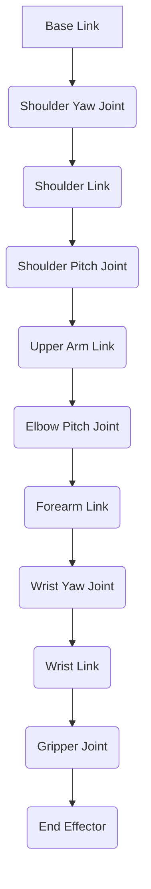

# 03 URDF & XACRO Modeling for Humanoid Robots

## 💡 Theory

To simulate and control complex robots like humanoids, we need a precise digital representation of their physical structure. In ROS, this is primarily achieved using **URDF (Unified Robot Description Format)**. URDF is an XML-based file format that describes all aspects of a robot, including its kinematic and dynamic properties, visual appearance, and collision geometry. It defines the robot as a tree of *links* (rigid bodies) connected by *joints* (allowing motion). Each link has mass, inertia, and visual/collision models, while each joint defines an axis of rotation/translation and limits. While powerful, pure URDF can become verbose and difficult to manage for highly articulated robots, leading to the introduction of **XACRO (XML Macros)**.

XACRO is an XML macro language that allows for more concise and readable robot descriptions. It enables developers to use macros, properties, and mathematical expressions to generate URDF files dynamically. This significantly reduces redundancy, improves maintainability, and makes it easier to create parameterized robot models, which is particularly beneficial for designing humanoid robots with many identical or similar components (e.g., fingers, leg segments).

### URDF vs. XACRO Comparison

| Feature           | URDF (Unified Robot Description Format)            | XACRO (XML Macros)                                  |
| :---------------- | :----------------------------------------------- | :-------------------------------------------------- |
| **Format**        | Pure XML                                         | XML with macros, properties, and expressions        |
| **Readability**   | Can be verbose and repetitive                    | Concise, reusable, improved readability             |
| **Maintainability**| Difficult for complex robots; prone to errors    | Easier for complex robots; less error-prone         |
| **Reusability**   | Low; duplication of common components            | High; macros allow reusable components              |
| **Parameterization**| Limited; requires manual changes for variations | Excellent; dynamic generation of URDF from parameters|
| **Output**        | Direct robot description                         | Generates a standard URDF file (pre-processed)      |

```xml
<!-- File: simple_robot.urdf (Simplified URDF Example) -->
<robot name="simple_robot">
  <link name="base_link">
    <visual>
      <geometry><box size="0.1 0.1 0.1"/></geometry>
    </visual>
  </link>
  <link name="arm_link">
    <visual>
      <geometry><cylinder radius="0.02" length="0.2"/></geometry>
    </visual>
  </link>
  <joint name="base_to_arm" type="revolute">
    <parent link="base_link"/>
    <child link="arm_link"/>
    <origin xyz="0 0 0.05"/>
    <axis xyz="0 1 0"/>
    <limit effort="1000" velocity="0.5" lower="-1.57" upper="1.57"/>
  </joint>
</robot>
```

```xml
<!-- File: simple_robot.xacro (Simplified XACRO Example) -->
<?xml version="1.0"?>
<robot xmlns:xacro="http://www.ros.org/wiki/xacro" name="simple_xacro_robot">

  <xacro:property name="arm_length" value="0.2"/>
  <xacro:property name="arm_radius" value="0.02"/>

  <xacro:macro name="default_link" params="name length radius">
    <link name="${name}">
      <visual>
        <geometry><cylinder radius="${radius}" length="${length}"/></geometry>
      </visual>
    </link>
  </xacro:macro>

  <link name="base_link">
    <visual>
      <geometry><box size="0.1 0.1 0.1"/></geometry>
    </visual>
  </link>

  <xacro:default_link name="arm_link" length="${arm_length}" radius="${arm_radius}"/>

  <joint name="base_to_arm" type="revolute">
    <parent link="base_link"/>
    <child link="arm_link"/>
    <origin xyz="0 0 0.05"/>
    <axis xyz="0 1 0"/>
    <limit effort="1000" velocity="0.5" lower="-1.57" upper="1.57"/>
  </joint>
</robot>
```

## 🎓 Key Insight

For humanoid robots, XACRO is almost always preferred over pure URDF due to the inherent complexity and repetitive nature of human-like anatomy. A humanoid robot typically has many identical components (e.g., multiple finger segments, symmetrical left/right arms) that benefit immensely from XACRO's macro capabilities. Parameterization in XACRO allows for easily scaling the robot, adjusting limb lengths, or modifying joint properties without manually editing dozens or hundreds of lines of XML. This dramatically accelerates the design iteration process, facilitates maintenance, and reduces the likelihood of errors that can arise from manual duplication. Generating a URDF from a concise XACRO description ensures a consistent and accurate robot model, which is critical for realistic simulation and precise control.

### Robot Kinematic Hierarchy (Simplified Humanoid Arm)



## 💬 Practice Exercise: "Ask your AI"

Consider designing a new three-fingered robotic hand for a humanoid robot. Each finger has three phalanges (links) connected by two revolute joints. How would you leverage XACRO macros and properties to define this hand efficiently, minimizing repetitive code? What parameters would you expose to easily adjust the length of the phalanges or the range of motion for the joints? Provide a hypothetical `curl` command to the `/urdf-xacro-modeling` endpoint that requests a validation of a conceptual XACRO model, and describe the expected JSON response indicating its validity and generated URDF size.

```bash
# Live curl example for the FastAPI backend
# Assume FastAPI is running on http://localhost:8000
curl -X GET "http://localhost:8000/urdf-xacro-modeling"
```

**Expected JSON Response (hypothetical, for URDF/XACRO model validation):**
```json
{
  "status": "VALID",
  "model_name": "three_fingered_hand",
  "format": "XACRO",
  "processed_urdf_size_kb": 12.5,
  "joint_count": 6,
  "link_count": 9,
  "warnings": [],
  "validation_timestamp": "2025-12-05T17:30:00Z"
}
```