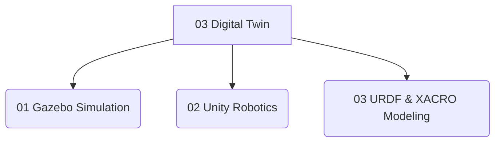

# 03 Digital Twin

 <!-- Replace with actual image link -->

Welcome to **Module 03: The Digital Twin**! This module explores the crucial role of digital twins in modern robotics development. A digital twin is a virtual model designed to accurately reflect a physical object, process, or system. In the context of humanoid robotics, digital twins enable developers to simulate, test, and refine robot behaviors in a safe and controlled virtual environment before deploying them to the real world. We will delve into popular simulation platforms like Gazebo and Unity, learn how to create detailed robot models using URDF and XACRO, and understand the benefits of leveraging digital twins for rapid prototyping, debugging, and training of AI systems.

## Module Overview

This module covers:

*   **Gazebo Simulation**: High-fidelity physics simulation for ROS-enabled robots.
*   **Unity Robotics**: Advanced visualization and interactive simulation environments.
*   **URDF & XACRO Modeling**: Describing robot kinematics, dynamics, and visuals.

## Module Structure

## Dive into the Lessons:

*   [Lesson 01: Gazebo Simulation](./01-gazebo-simulation)
*   [Lesson 02: Unity Robotics](./02-unity-robotics)
*   [Lesson 03: URDF & XACRO Modeling](./03-urdf-xacro)
