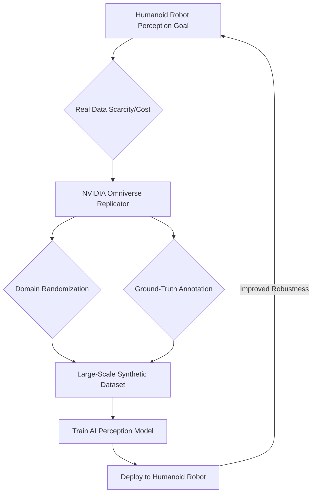

# 02 Synthetic Data Generation with NVIDIA Omniverse Replicator

## 💡 Theory

**Synthetic Data Generation (SDG)** is the process of creating artificial datasets that mimic the properties of real-world data. In robotics, SDG is rapidly becoming indispensable, especially for training AI perception models (e.g., object detection, segmentation, pose estimation) for humanoid robots. Real-world data collection is often expensive, time-consuming, difficult to label, and may not cover rare or dangerous scenarios.

**NVIDIA Omniverse Replicator** is a powerful SDK built into Isaac Sim that enables the generation of high-quality, physically accurate synthetic data. Replicator allows developers to programmatically control the simulation environment, randomize scene elements (lighting, textures, object positions, camera angles), and automatically generate ground-truth labels (bounding boxes, segmentation masks, depth maps) at scale. This addresses key challenges:

1.  **Data Scarcity:** Generate unlimited amounts of data for scenarios where real data is hard to obtain.
2.  **Bias Reduction:** Control data distribution to reduce biases present in real-world datasets.
3.  **Edge Cases:** Create data for rare or hazardous situations that are critical for robust robot operation.
4.  **Cost-Effectiveness:** Significantly reduce the cost and time associated with manual data collection and labeling.

### Key Capabilities of Omniverse Replicator

| Capability           | Description                                                                                                                                                                                                       |
| :------------------- | :-------------------------------------------------------------------------------------------------------------------------------------------------------------------------------------------------------------------- |
| **Domain Randomization** | Randomize various aspects of the simulation (e.g., lighting, textures, object positions, camera properties) to improve model generalization and sim-to-real transfer.                                               |
| **Sensor Emulation** | Simulate different sensor types (RGB cameras, depth cameras, LiDAR) with customizable parameters to match real-world hardware specifications.                                                                      |
| **Ground-Truth Annotation** | Automatically generate pixel-perfect labels (bounding boxes, semantic segmentation, instance segmentation, depth, surface normals) for every frame.                                                                 |
| **Python API**       | A programmatic interface that allows users to script data generation workflows, integrate with existing training pipelines, and automate the creation of complex datasets.                                           |

## 🎓 Key Insight

For humanoid robots, Omniverse Replicator's ability to perform **large-scale domain randomization and automated ground-truth annotation** is a game-changer for robust AI perception. Humanoids operate in highly dynamic and unstructured environments, requiring perception systems that can generalize across vast variations. Replicator enables training data to be generated with:

*   **Unseen Variations:** By randomizing visual parameters, AI models learn to ignore irrelevant details and focus on essential features, making them more resilient to real-world clutter and lighting changes.
*   **Precise Labels:** Automated, pixel-perfect ground truth is virtually impossible to obtain manually for complex 3D scenes, but crucial for high-performance deep learning models.
*   **"What-If" Scenarios:** Easily create data for failure modes or rare interactions, improving the robot's ability to perceive and react to unexpected events.

This approach significantly reduces the data bottleneck, allowing for the rapid development and deployment of highly capable perception systems for humanoid robots.



## 💬 Practice Exercise: "Ask your AI"

Consider a scenario where a humanoid robot needs to identify and grasp various tools (e.g., hammer, wrench, screwdriver) on a workbench. Design a synthetic data generation pipeline using Omniverse Replicator to train an object detection model for these tools. What randomization techniques would you employ (e.g., lighting, texture, pose, background objects)? What ground-truth annotations would be most critical for this task, and how would you configure Replicator to output them?

Provide a hypothetical `curl` command to the `/synthetic-data-generation` endpoint that initiates a synthetic data generation job within Isaac Sim, and describe the expected JSON response indicating the job ID and estimated completion time.

```bash
# Live curl example for the FastAPI backend
# Assume FastAPI is running on http://localhost:8000
curl -X POST "http://localhost:8000/synthetic-data-generation" \
     -H "Content-Type: application/json" \
     -d '{ "dataset_name": "humanoid_tools", "num_samples": 1000, "randomization_level": "high" }'
```

**Expected JSON Response (hypothetical, for Synthetic Data Generation):**
```json
{
  "status": "Synthetic data generation job started",
  "job_id": "sdg_job_12345",
  "estimated_completion_minutes": 45,
  "dataset_path": "omniverse://localhost/datasets/humanoid_tools_12345.usd"
}
```

```python
# File: replicator_basic_script.py
# This conceptual Python snippet demonstrates a basic structure for using
# Omniverse Replicator within Isaac Sim to generate synthetic data.
# Actual Replicator scripts involve more detailed API calls.

# import omni.replicator.core as rep
# from omni.isaac.core.utils.nucleus import get_assets_root_path
# from omni.isaac.core import World

# # Set up the simulation environment (conceptual)
# world = World(stage_units_in_meters=1.0)
# world.scene.add_default_ground_plane()

# # Define assets (conceptual - replace with actual USD paths)
# assets_root = get_assets_root_path()
# if assets_root is None:
#    print("Warning: Could not get assets root path. Skipping asset loading.")
#    exit()
# usd_path_hammer = os.path.join(assets_root, "NVIDIA/Assets/Props/Kitchen/Hammer.usd")
# usd_path_workbench = os.path.join(assets_root, "NVIDIA/Assets/Scenes/Templates/Simple_Warehouse.usd")

# # Initialize Replicator (conceptual)
# rep.initialize()
# with rep.script():
#     # Load environment and assets
#     rep.create.from_usd(usd_path_workbench)
#     hammer = rep.create.from_usd(usd_path_hammer, count=10) # Spawn multiple hammers

#     # Randomize properties (conceptual)
#     with hammer:
#         rep.modify.pose(position=rep.distribution.uniform((-100,-100,0), (100,100,50)),
#                         rotation=rep.distribution.uniform((-180,-180,-180), (180,180,180)))
#         rep.modify.material(shader_type="PBR",
#                             diffuse=rep.distribution.uniform((0.0,0.0,0.0), (1.0,1.0,1.0)))

#     # Attach render products and annotators (conceptual)
#     render_product = rep.create.render_product(camera=rep.create.camera(), resolution=(1024, 1024))
#     rep.WriterRegistry.get("BasicWriter").add_annotators([rep.AnnotatorRegistry.get("bounding_box_2d_tight"),
#                                                        rep.AnnotatorRegistry.get("semantic_segmentation")])
#     rep.WriterRegistry.get("BasicWriter").attach([render_product])

# # Run generation (conceptual)
# rep.orchestrator.run(num_frames=100) # Generate 100 frames of data

# # cleanup
# rep.shutdown()

print("Conceptual Omniverse Replicator script for synthetic data generation.")
print("Full scripts require Isaac Sim environment and Replicator SDK installed.")
```