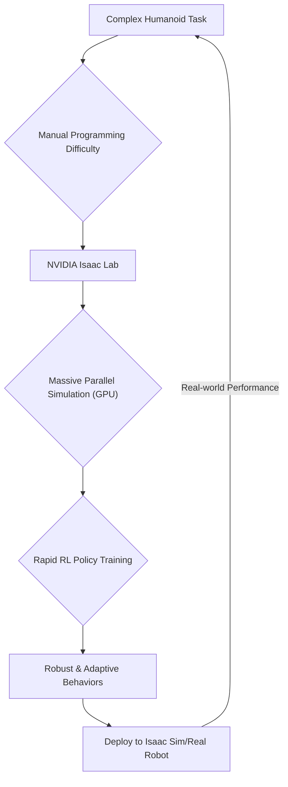

# 04 Reinforcement Learning in Isaac Lab: Training Intelligent Behaviors

## 💡 Theory

**Reinforcement Learning (RL)** is a powerful paradigm for training agents to make sequential decisions in an environment to maximize a cumulative reward. In robotics, RL has shown immense potential for learning complex motor skills, control policies, and adaptive behaviors that are difficult to program manually. **NVIDIA Isaac Lab** (formerly Isaac Gym and Isaac Orbit) is a highly optimized, GPU-accelerated framework designed specifically for developing and training RL policies for robotics.

Isaac Lab enables researchers and engineers to:

1. **Massive Parallelism:** Simulate thousands of robot environments in parallel on a single GPU, dramatically accelerating the data collection and training process for RL algorithms.
2. **Flexible Environments:** Create custom robotic tasks and environments with configurable rewards, observations, and action spaces.
3. **Advanced Algorithms:** Supports integration with popular RL algorithms (e.g., PPO, SAC) and provides tools for policy learning, domain randomization, and sim-to-real transfer.
4. **Hardware-Accelerated Physics:** Leverages NVIDIA PhysX for accurate and fast physics simulation, crucial for realistic robot interactions and stable learning.

By abstracting away the complexities of simulation and providing a streamlined RL workflow, Isaac Lab empowers the training of highly intelligent and agile humanoid robot behaviors.

### Isaac Lab RL Workflow

| Step               | Description                                                                                                                                                                                                         |
| :----------------- | :-------------------------------------------------------------------------------------------------------------------------------------------------------------------------------------------------------------------- |
| **Environment Design** | Define the robot, task, reward function, observation space, and action space within Isaac Lab's extensible framework.                                                                                                |
| **Policy Network**   | Choose or design a neural network architecture (e.g., actor-critic) to represent the robot's policy and value function.                                                                                              |
| **Training Loop**    | Run the RL algorithm, collecting experiences from parallel simulations, updating the policy network based on rewards, and iterating over millions of steps.                                                            |
| **Domain Randomization** | Randomize simulation parameters during training (e.g., friction, mass, sensor noise) to improve the generalization and sim-to-real transferability of the learned policy.                                         |
| **Policy Deployment**| Export the trained policy and deploy it to a simulated robot in Isaac Sim or a real physical robot.                                                                                                                   |

## 🎓 Key Insight

The unparalleled **GPU-accelerated parallelism** offered by NVIDIA Isaac Lab is the single most transformative feature for training advanced reinforcement learning policies for humanoid robots. Humanoid control, such as dynamic locomotion, dexterous manipulation, and agile whole-body behaviors, requires an enormous amount of data and computational power. Isaac Lab addresses this by:

* **Accelerating Training:** Instead of training on a single simulation, hundreds or thousands of identical environments run concurrently, collecting experiences in parallel. This drastically reduces the time needed to converge on complex policies.
* **Enabling Complex Tasks:** The ability to rapidly explore vast state-action spaces makes it feasible to train for highly intricate and challenging tasks that would be intractable with traditional methods.
* **Robustness through Randomization:** Parallelism facilitates aggressive domain randomization, exposing the learning agent to a wide variety of conditions, leading to more robust policies that perform well in diverse real-world scenarios.
* **Cost-Effective Iteration:** Rapid experimentation in simulation minimizes reliance on expensive and time-consuming physical robot trials.



## 💬 Practice Exercise: "Ask your AI"

Consider training a humanoid robot to perform a backflip using reinforcement learning in Isaac Lab. Describe the process you would follow to define the RL environment: specifically, how would you set up the observation space (e.g., joint angles, velocities, IMU data, center of mass), the action space (e.g., joint torques or target positions), and the reward function to encourage a successful backflip? What domain randomization techniques might be crucial for the policy to generalize to different robot parameters or landing surfaces?

Provide a hypothetical `curl` command to the `/reinforcement-learning` endpoint that initiates an RL training job in Isaac Lab, and describe the expected JSON response indicating the job status and a link to the training logs.

```bash
# Live curl example for the FastAPI backend
# Assume FastAPI is running on http://localhost:8000
curl -X POST "http://localhost:8000/reinforcement-learning" \
     -H "Content-Type: application/json" \
     -d '{ "task": "humanoid_backflip", "policy_type": "PPO", "num_iterations": 10000 }'
```

**Expected JSON Response (hypothetical, for RL Training Job):**
```json
{
  "status": "RL training job started",
  "job_id": "rl_backflip_456",
  "estimated_completion_hours": 8,
  "log_link": "http://localhost:8000/logs/rl_backflip_456.log"
}
```

```python
# File: isaac_lab_rl_concept.py
# Conceptual Python snippet for defining an RL environment in Isaac Lab.
# This illustrates the key components: observations, actions, and rewards.

import numpy as np
# from omni.isaac.lab.envs import ManagerBasedRLEnv
# from omni.isaac.lab.utils import default_cfg

class ConceptualHumanoidEnv(): # ManagerBasedRLEnv
    def __init__(self, cfg):
        # super().__init__(cfg)
        self.num_actions = cfg["env"].num_actions
        self.num_observations = cfg["env"].num_observations
        print(f"Conceptual Isaac Lab RL environment initialized.")
        print(f"  Observation space size: {self.num_observations}")
        print(f"  Action space size: {self.num_actions}")

    def _design_specs(self, env_cfg):
        # Define sensors, physics materials, assets for the humanoid
        # Define randomization components
        print("Conceptual: Designed environment specifications (robot, task, randomization).")

    def _reset_idx(self, env_ids):
        # Reset specific environments based on their IDs
        print(f"Conceptual: Resetting environments with IDs {env_ids}.")

    def _get_observations(self):
        # Collect observations from all parallel environments
        # e.g., joint positions, velocities, IMU data, contact forces
        return np.random.rand(self.num_envs, self.num_observations) # Conceptual random data

    def _get_rewards(self):
        # Calculate rewards for all parallel environments
        # This is where the backflip success criteria and penalties would be defined.
        return np.random.rand(self.num_envs) # Conceptual random rewards

    def _apply_actions(self, actions):
        # Apply actions (e.g., joint torques) to all parallel environments
        print("Conceptual: Applying actions to robots.")

# Conceptual configuration for an RL environment
# env_cfg = default_cfg.make_env_cfg()
# env_cfg.num_envs = 4096 # Example: thousands of parallel environments
# env_cfg.env.num_actions = 20 # Example: 20 joint torques
# env_cfg.env.num_observations = 100 # Example: sensory inputs
# conceptual_env = ConceptualHumanoidEnv(env_cfg)
# obs = conceptual_env._get_observations()
# rewards = conceptual_env._get_rewards()
# conceptual_env._apply_actions(np.random.rand(4096, 20))

print("Conceptual Isaac Lab RL environment setup. Actual code requires Isaac Lab framework.")
```