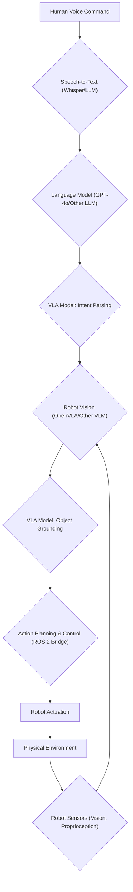

# 01 VLA Fundamentals: Bridging Perception and Action with Language

## 💡 Theory

**Vision-Language-Action (VLA) models** represent a pivotal advancement in robotics, enabling agents to understand and execute complex tasks described through natural language, grounded in visual perception. Unlike traditional robotics where tasks are hard-coded or learned through extensive trial-and-error in a narrow domain, VLA models combine large language models (LLMs) with visual encoders and robot control interfaces. This fusion allows robots to interpret high-level human commands, perceive their environment, reason about potential actions, and translate those insights into low-level motor commands.

At its core, a VLA model typically involves:

1. **Visual Perception**: Processing raw sensor data (e.g., camera images, depth maps) to understand the scene, identify objects, and infer their properties and states.
2. **Language Understanding**: Interpreting natural language instructions, resolving ambiguities, and extracting the intent and key entities involved in a task.
3. **Action Grounding**: Connecting the linguistic understanding and visual perception to the robot's action space. This involves mapping abstract instructions to a sequence of actionable steps or continuous control signals.
4. **Policy Learning/Execution**: Utilizing learned policies (often from large datasets or reinforcement learning) to generate precise robot movements to achieve the desired outcome.

This paradigm shift allows for more intuitive human-robot interaction and significantly expands the range of tasks robots can perform in unstructured environments.

## 🎓 Key Insight

The fundamental breakthrough in VLA models is the concept of **cross-modal reasoning and grounding**. Traditional AI often treats vision, language, and action as separate problems. VLA models, however, explicitly learn representations that fuse information from these disparate modalities, allowing for emergent reasoning capabilities. For instance, an instruction like "pick up the red mug" requires the robot to visually identify "red mug" among other objects, understand "pick up" as a manipulation primitive, and then plan a sequence of actions (reach, grasp, lift) that are physically grounded in its environment. The *key insight* is that by training on vast datasets of paired visual observations, language instructions, and corresponding actions, these models learn to *generalize* to novel situations and objects, even if they haven't seen that exact combination before. This generalization drastically reduces the need for explicit programming or re-training for every new task.

## 💬 Practice Exercise: "Ask your AI"

Consider a VLA-powered humanoid robot in a kitchen environment. A human user gives the command: "Please get me the apple from the fruit bowl on the counter and place it on the table." Describe the internal VLA pipeline steps the robot would likely take, from raw sensory input to successful execution. Specifically, how would the model handle:

1. **Ambiguity/Context**: What if there are multiple "red" objects or multiple "bowls"?
2. **Object Localization**: How would it pinpoint the exact apple and the fruit bowl?
3. **Action Sequencing**: How does "get me the apple" translate into a series of robot movements?
4. **Error Recovery**: What if the apple slips during grasping?

Provide a hypothetical `curl` command to a new FastAPI endpoint `/vla/execute` that simulates sending this command to the robot, including a conceptual image URL and the voice command. Describe the expected JSON response, indicating the task status, a unique task ID, and a confidence score.

```bash
# Live curl example for the FastAPI backend
# Assume FastAPI is running on http://localhost:8000
curl -X POST "http://localhost:8000/vla/execute" \
     -H "Content-Type: application/json" \
     -d '{ "image_url": "https://i.imgur.com/kitchen_scene_01.png", "command": "Please get me the apple from the fruit bowl on the counter and place it on the table." }'
```

**Expected JSON Response (hypothetical, for VLA task execution):**

```json
{
  "status": "Task received and processing",
  "task_id": "vla_kitchen_task_789",
  "confidence": 0.95,
  "estimated_completion_time_seconds": 30,
  "robot_status": "planning_path"
}
```

```python
# File: vla_pipeline_concept.py
# Conceptual Python snippet illustrating the VLA pipeline stages.
# In a real system, each stage would involve complex AI models and robot APIs.

import numpy as np

class VLAPipeline:
    def __init__(self, robot_api_client):
        self.robot_api = robot_api_client
        print("VLA Pipeline initialized with robot API.")

    def process_command(self, image_url, voice_command):
        print(f"\nProcessing command: '{voice_command}' with image: {image_url}")

        # 1. Visual Perception (Conceptual)
        visual_features = self._extract_visual_features(image_url)
        print(f"  - Visual perception: Extracted {visual_features.shape[0]} features.")

        # 2. Language Understanding (Conceptual)
        parsed_intent, target_object, target_location = self._parse_language(voice_command)
        print(f"  - Language understanding: Intent='{parsed_intent}', Object='{target_object}', Location='{target_location}'.")

        # 3. Action Grounding (Conceptual)
        robot_action_plan = self._ground_action(visual_features, parsed_intent, target_object, target_location)
        print(f"  - Action grounding: Generated plan with {len(robot_action_plan)} steps.")

        # 4. Policy Execution (Conceptual)
        success = self._execute_plan(robot_action_plan)
        if success:
            print("  - Policy execution: Task completed successfully!")
        else:
            print("  - Policy execution: Task failed or encountered issues.")
        return success

    def _extract_visual_features(self, image_url):
        # Simulate visual feature extraction from an image
        return np.random.rand(128, 768) # Example: 128 bounding box embeddings

    def _parse_language(self, command):
        # Simulate parsing natural language command
        if "apple" in command and "fruit bowl" in command:
            return "pick_and_place", "apple", "table"
        return "unknown", "none", "none"

    def _ground_action(self, visual_features, intent, obj, loc):
        # Simulate grounding abstract intent to robot-specific actions
        if intent == "pick_and_place" and obj == "apple":
            return ["move_to_bowl", "detect_apple", "grasp_apple", "move_to_table", "release_apple"]
        return []

    def _execute_plan(self, plan):
        # Simulate executing robot actions
        if not plan:
            return False
        for step in plan:
            print(f"    -> Executing robot command: {step}")
            # self.robot_api.execute_command(step) # Conceptual API call
            if "grasp" in step and np.random.rand() < 0.1: # 10% chance of grasp failure
                print("      ! Grasp failed, initiating re-grasp attempt.")
                # return False # For simple failure simulation
        return True

# Conceptual Robot API Client
class ConceptualRobotAPI:
    def execute_command(self, cmd):
        # print(f"  [RobotAPI] Executing: {cmd}")
        pass

# Conceptual Usage
# robot_client = ConceptualRobotAPI()
# vla_pipeline = VLAPipeline(robot_client)
# vla_pipeline.process_command(
#     "https://i.imgur.com/kitchen_scene_01.png",
#     "Please get me the apple from the fruit bowl on the counter and place it on the table."
# )

print("Conceptual VLA pipeline ready for integration. Requires actual robot APIs and trained models.")
```


