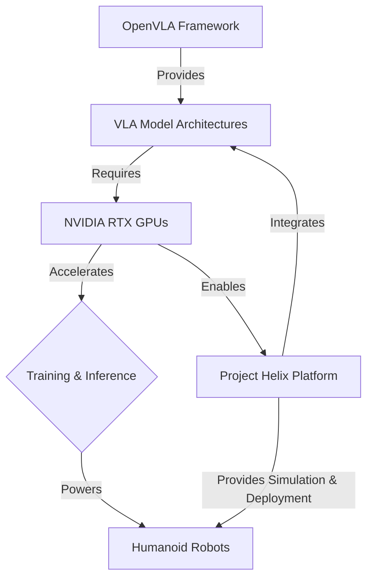

# 03 OpenVLA, RTX, and Project Helix: Accelerating VLA Research

## 💡 Theory

The advancement of Vision-Language-Action (VLA) models is intrinsically linked to powerful hardware and specialized software frameworks that enable efficient training and deployment. This lesson delves into key technologies accelerating VLA research and application:

1.  **OpenVLA**: OpenVLA is an open-source framework designed to facilitate research and development in VLA models. It provides a modular architecture, pre-trained components (vision encoders, language models, action decoders), and tools for fine-tuning on custom robotic datasets. The goal of OpenVLA is to lower the barrier to entry for VLA research, allowing developers to experiment with different architectural choices and integrate them with diverse robot platforms. It often includes implementations of state-of-the-art VLA models and benchmarks.
2.  **NVIDIA RTX GPUs**: NVIDIA's RTX series GPUs are critical for VLA development due to their Tensor Cores, which significantly accelerate matrix operations fundamental to deep learning. Training large VLA models, which involve billions of parameters and vast amounts of multimodal data, demands immense computational power. RTX GPUs provide the necessary parallel processing capabilities, memory bandwidth, and specialized AI acceleration to make this feasible, dramatically reducing training times and enabling larger, more complex models.
3.  **Project Helix (NVIDIA)**: Project Helix is an NVIDIA initiative that focuses on a comprehensive platform for the development and deployment of robotics and embodied AI. It integrates various NVIDIA technologies, including Isaac Sim for simulation, Omniverse for digital twin creation, and AI frameworks like OpenVLA. Helix aims to provide a unified environment where researchers and engineers can design, train, and test VLA-powered robots across simulation and real-world scenarios. It emphasizes modularity, scalability, and performance, crucial for the next generation of autonomous humanoids.

These technologies collectively push the boundaries of what is possible in VLA robotics, enabling faster iteration, more powerful models, and more capable robots.

## 🎓 Key Insight

The profound insight here is that **hardware-software co-design and open platforms are paramount for scaling VLA research from theoretical concepts to deployable humanoid robots.** Without highly optimized computational hardware like NVIDIA RTX GPUs, training sophisticated VLA models would be prohibitively slow and resource-intensive. Similarly, frameworks like OpenVLA provide standardized interfaces and reusable components, preventing researchers from reinventing the wheel and fostering collaborative innovation. Project Helix then unifies these elements into an ecosystem that bridges the simulation-to-reality gap, allowing for seamless transfer of learned policies. This synergistic approach — powerful hardware, open software, and integrated development platforms — is the engine driving the rapid progress we see in VLA-powered humanoids, allowing for the development of models that can truly perceive, reason, and act in complex, dynamic environments.

## 💬 Practice Exercise: "Ask your AI"

Imagine your robotics startup is tasked with implementing a new VLA-driven manipulation skill (e.g., precise assembly of small components) on a humanoid robot. You decide to leverage OpenVLA for the core VLA model, train it on a custom dataset, and deploy it using NVIDIA RTX infrastructure and components from Project Helix. Describe how each of these technologies would contribute to your workflow, from dataset generation and model training to deployment and real-time inference.

Provide a hypothetical `curl` command to a FastAPI endpoint `/vla/deploy-model` that simulates initiating the deployment of a new OpenVLA model version to a robot fleet, including the model ID, target robot group, and the NVIDIA RTX device to be used. Describe the expected JSON response, confirming the deployment status and any potential warnings.

```bash
# Live curl example for the FastAPI backend
# Assume FastAPI is running on http://localhost:8000
curl -X POST "http://localhost:8000/vla/deploy-model" \
     -H "Content-Type: application/json" \
     -d '{ "model_id": "openvla_assembly_v1.2", "target_group": "humanoid_lab_fleet", "rtx_device_id": "gpu:0" }'
```

**Expected JSON Response (hypothetical, for VLA Model Deployment):**
```json
{
  "status": "Deployment initiated successfully",
  "deployment_id": "deploy_vla_7890",
  "target_robots_affected": 5,
  "warnings": [],
  "estimated_completion_time_seconds": 120
}
```

```python
# File: openvla_rtx_helix_concept.py
# Conceptual Python snippet for demonstrating OpenVLA, RTX, and Project Helix integration.

import os
import time

class OpenVLAModel:
    def __init__(self, model_name="openvla_base"):
        self.model_name = model_name
        self.is_trained = False
        print(f"OpenVLA model '{self.model_name}' initialized.")

    def train(self, dataset_path, rtx_enabled=True):
        print(f"\n [OpenVLA] Starting training of '{self.model_name}' on {dataset_path}...")
        if rtx_enabled:
            print(" [OpenVLA] Leveraging NVIDIA RTX Tensor Cores for acceleration.")
        time.sleep(3) # Simulate training time
        self.is_trained = True
        print(f" [OpenVLA] Model '{self.model_name}' training complete.")

    def infer(self, visual_input, language_input):
        if not self.is_trained:
            raise RuntimeError("Model not trained. Please call train() first.")
        print(f"\n [OpenVLA] Performing inference for '{language_input}' with visual data...")
        time.sleep(0.5) # Simulate inference time
        # Conceptual output: e.g., predicted action, object detection
        action_prediction = "grasp_object"
        confidence = 0.92
        print(f" [OpenVLA] Inference result: Action='{action_prediction}', Confidence={confidence:.2f}")
        return {"action": action_prediction, "confidence": confidence}

class ProjectHelixPlatform:
    def __init__(self, simulation_env="isaac_sim_lab"):
        self.simulation_env = simulation_env
        print(f"Project Helix platform initialized with {self.simulation_env}.")

    def deploy_model(self, openvla_model: OpenVLAModel, target_robot_id: str):
        if not openvla_model.is_trained:
            print(" [Helix] Warning: Deploying an untrained model. Proceeding for demonstration.")
        print(f"\n [Helix] Deploying model '{openvla_model.model_name}' to robot '{target_robot_id}'...")
        time.sleep(2) # Simulate deployment process
        print(f" [Helix] Model '{openvla_model.model_name}' deployed to '{target_robot_id}' successfully.")

    def run_simulation(self, scenario_name, deployed_model: OpenVLAModel):
        print(f"\n [Helix] Running simulation '{scenario_name}' in {self.simulation_env} with model '{deployed_model.model_name}'...")
        time.sleep(4) # Simulate complex simulation run
        print(f" [Helix] Simulation '{scenario_name}' completed. Results available in Omniverse.")

# Conceptual Usage:
# openvl-inst = OpenVLAModel()
# openvl-inst.train(dataset_path="/data/robot_manipulation_vla")

# helix_platform = ProjectHelixPlatform()
# helix_platform.deploy_model(openvl-inst, target_robot_id="humanoid_01")
# helix_platform.run_simulation(scenario_name="precision_assembly", deployed_model=openvl-inst)

print("Conceptual OpenVLA, RTX, and Project Helix integration modules defined.")
print(f"NVIDIA RTX GPUs are essential for accelerating training of VLA models due to their Tensor Cores.")
```


