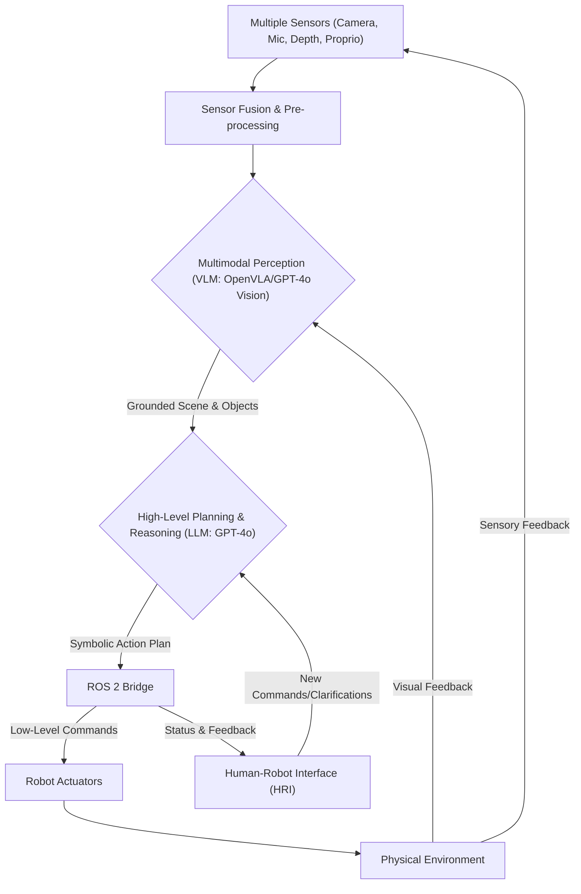

# 04 Full VLA Stack Integration: Building an End-to-End System

## 💡 Theory

Integrating the full Vision-Language-Action (VLA) stack is about combining all individual components—from sensory input to motor output—into a cohesive, functional system that enables truly intelligent robotic behavior. This involves orchestrating various AI models, middleware frameworks, and hardware interfaces to work in concert. A typical full VLA integration involves the following stages:

1. **Sensor Fusion and Pre-processing**: Raw data from multiple sensors (e.g., cameras, microphones, depth sensors, proprioceptors) are collected and fused to create a rich, multimodal representation of the environment. This often involves data synchronization and initial processing (e.g., noise reduction, feature extraction) to prepare data for AI models.
2. **Multimodal Perception (Vision-Language Models)**: The fused sensory data is fed into a VLA model (e.g., OpenVLA, or a custom-trained model leveraging GPT-4o's vision capabilities) that performs object recognition, scene understanding, and grounds natural language instructions within the visual context. This stage is crucial for the robot to understand *what* it is seeing and *how* it relates to human commands.
3. **High-Level Planning and Reasoning**: A central reasoning module (often an advanced LLM like GPT-4o, possibly fine-tuned for robotics) takes the grounded perception and parsed language intent to generate a high-level, symbolic action plan. This plan might involve complex sequences of tasks, decision-making under uncertainty, and adapting to dynamic environmental changes.
4. **Low-Level Motion Control and Execution (ROS 2 Bridge)**: The high-level action plan is decomposed into a series of low-level, executable robot commands. This is where a robust robotic middleware like ROS 2, acting as a bridge, becomes indispensable. It handles communication with the robot's actuators, manages inverse kinematics, trajectory generation, and ensures safe and precise execution of movements. Custom ROS 2 nodes can be developed to interface with specific hardware and implement robot-specific control strategies.
5. **Human-Robot Interaction (HRI) and Feedback**: The integrated system must also include robust HRI capabilities, allowing humans to provide new commands, clarify ambiguities, and receive real-time feedback on the robot's progress and state. This feedback loop, which might involve speech synthesis or visual displays, is vital for collaborative tasks and ensuring user trust.

Achieving seamless integration across these stages is the ultimate goal of developing autonomous humanoid robots.

## 🎓 Key Insight

The most profound insight in achieving full VLA stack integration is the realization that **the robot's ability to operate autonomously and robustly hinges on the continuous, real-time feedback loop between all stages, especially between perception, planning, and execution.** It's not a linear pipeline but a dynamic, interconnected system where information constantly flows back and forth. For instance, execution monitoring (via ROS 2) can provide feedback to the planner if an action fails, prompting re-planning. Similarly, improved visual perception can refine the LLM's understanding, leading to more precise action grounding. The **ROS 2 bridge** is particularly critical here, as it provides the standardized communication backbone, allowing for modular development and fault isolation. This iterative and self-correcting nature, enabled by strong feedback mechanisms and robust middleware, transforms a collection of intelligent components into a truly intelligent and adaptive robotic system capable of tackling complex, real-world challenges.

## 💬 Practice Exercise: "Ask your AI"

Design a conceptual full VLA stack for a humanoid robot operating in a smart home environment, capable of understanding commands like "Clean up the living room, starting with putting away the books." Detail the specific AI models (e.g., Whisper, GPT-4o, OpenVLA) and robotic components (e.g., ROS 2 nodes for navigation, manipulation) that would be involved at each stage of the integration (sensor fusion, multimodal perception, high-level planning, low-level control, HRI). How would the system handle the prioritization of sub-tasks and adapt if a specified object (like a book) is not found in its expected location?

Provide a hypothetical `curl` command to a FastAPI endpoint `/vla/integrate-command` that simulates initiating such a complex multi-stage command, including the command text and an indication of the desired level of autonomy. Describe the expected JSON response, providing a high-level overview of the initiated plan, key parameters, and the initial status.

```bash
# Live curl example for the FastAPI backend
# Assume FastAPI is running on http://localhost:8000
curl -X POST "http://localhost:8000/vla/integrate-command" \
     -H "Content-Type: application/json" \
     -d '{ "command": "Clean up the living room, starting with putting away the books.", "autonomy_level": "high" }'
```

**Expected JSON Response (hypothetical, for full VLA stack integration command):**
```json
{
  "status": "Integrated task initiated",
  "task_id": "smart_home_cleanup_001",
  "overall_plan_summary": "Prioritized cleanup of living room, starting with books, then general tidying.",
  "initial_subtask": "locate_books_in_living_room",
  "current_robot_mode": "exploring_for_objects",
  "confidence": 0.96
}
```

```python
# File: full_vla_stack.py
# Conceptual Python snippet demonstrating full VLA stack integration.

import time
import random

# --- Component Mock-ups ---
class SensorFusionModule:
    def get_multimodal_data(self):
        print(" [Sensors] Fusing camera, audio, and depth data...")
        time.sleep(0.1)
        return {"visual": "img_data", "audio": "audio_data", "depth": "depth_data"}

class MultimodalPerceptionModel:
    def process(self, multimodal_data, language_instruction):
        print(f" [Perception] Processing visual and linguistic input: '{language_instruction}'...")
        time.sleep(0.3)
        # Simulate object detection, scene graph generation, and grounding
        grounded_objects = {
            "books": [{"id": "book_01", "location": "shelf_A"}],
            "living_room": {"bounds": "(x,y,z)"}
        }
        intent = "clean_up_area"
        print(" [Perception] Grounded objects and intent identified.")
        return {"intent": intent, "grounded_objects": grounded_objects}

class HighLevelPlanner:
    def generate_complex_plan(self, perception_output):
        intent = perception_output["intent"]
        objects = perception_output["grounded_objects"]
        print(f" [Planner] Generating high-level plan for '{intent}'...")

        plan = []
        if "books" in objects:
            for book in objects["books"]:
                plan.append(f"pick_and_place_{book['id']}_to_bookshelf")
        plan.append("tidy_general_items")
        plan.append("report_completion")
        print(f" [Planner] Plan generated: {len(plan)} steps.")
        time.sleep(0.4)
        return {"full_plan": plan, "current_subtask_index": 0}

class ROS2ControlBridge:
    def execute_low_level_command(self, command):
        print(f" [ROS2 Bridge] Executing: {command}")
        time.sleep(0.2)
        # Simulate success/failure
        if "pick_and_place" in command and random.random() < 0.1: # 10% failure rate
            print(f" [ROS2 Bridge] WARNING: Command '{command}' failed during execution.")
            return False
        return True

class HumanRobotInterface:
    def provide_feedback(self, message):
        print(f" [HRI] Robot Feedback: {message}")

# --- Full VLA Orchestrator ---
class FullVLAStackOrchestrator:
    def __init__(self):
        self.sensors = SensorFusionModule()
        self.perception = MultimodalPerceptionModel()
        self.planner = HighLevelPlanner()
        self.ros_bridge = ROS2ControlBridge()
        self.hri = HumanRobotInterface()

    def run_task(self, voice_command, autonomy_level="high"):
        print(f"\n--- Initiating Full VLA Task: '{voice_command}' (Autonomy: {autonomy_level}) ---")

        # 1. Sense and Perceive
        multimodal_data = self.sensors.get_multimodal_data()
        perception_output = self.perception.process(multimodal_data, voice_command)

        # 2. Plan High-Level Actions
        plan_state = self.planner.generate_complex_plan(perception_output)
        full_plan = plan_state["full_plan"]
        current_index = plan_state["current_subtask_index"]

        # 3. Execute and Monitor
        while current_index < len(full_plan):
            subtask = full_plan[current_index]
            self.hri.provide_feedback(f"Working on subtask: {subtask}")
            success = self.ros_bridge.execute_low_level_command(subtask)

            if not success and autonomy_level == "high":
                print(" [Orchestrator] Attempting re-plan due to subtask failure...")
                # Conceptual re-planning: for simplicity, just skip and warn
                self.hri.provide_feedback(f"Failed to complete '{subtask}'. Skipping for now.")
            elif not success and autonomy_level == "medium":
                self.hri.provide_feedback(f"Subtask '{subtask}' failed. Requesting human intervention.")
                break # Stop for human

            current_index += 1
            time.sleep(0.5) # Simulate action duration

        self.hri.provide_feedback("Task execution finished.")
        print("--- Full VLA Task Completed/Stopped ---\n")

# Conceptual Usage:
# vla_system = FullVLAStackOrchestrator()
# vla_system.run_task("Clean up the living room, starting with putting away the books.", autonomy_level="high")

print("Full VLA Stack Integration modules defined. Requires real-time sensor data, trained models, and robot control interfaces.")
```


