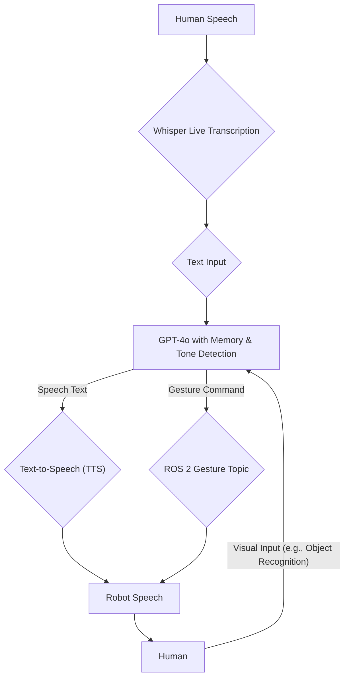

Conversational robotics represents the pinnacle of human-robot interaction, enabling natural, intuitive communication that transcends simple command execution. By integrating advanced AI models for speech, language, and emotional understanding with robotic control systems, we can create robots that are not just intelligent, but truly interactive and empathetic.

# 💡  06 The Conversational Stack

## 💡 Theory

Natural conversation with a robot involves a complex interplay of perception, cognition, and action. This "conversational stack" typically includes:

1. **Speech Recognition (ASR):** Transcribing human speech into text.
2. **Natural Language Understanding (NLU):** Interpreting the meaning, intent, and entities within the text, including emotional tone.
3. **Dialogue Management (DM):** Maintaining conversation state, memory, and context to facilitate multi-turn interactions.
4. **Natural Language Generation (NLG):** Formulating appropriate text responses.
5. **Speech Synthesis (TTS):** Converting text responses back into spoken language.
6. **Non-Verbal Communication:** Generating gestures, facial expressions, and body language to complement verbal interaction.

This multi-modal approach creates a richer, more human-like communication experience, essential for robots operating in social environments.

### 🎓 Key Insight: Embodied AI for Natural Interaction

The effectiveness of conversational robotics is profoundly enhanced by embodiment. A robot that can interpret your tone, respond with an appropriate gesture, and maintain eye contact feels more "present" and understanding than a disembodied voice. Integrating VLA models with real-time sensory input (vision, audio) allows robots to ground abstract language in physical reality, leading to more robust and contextually aware interactions. Emotional tone detection adds another layer, enabling robots to adapt their responses and behavior to the user's affective state, moving towards truly empathetic AI.

### 💬 Ask your AI: Designing Ethical Conversational Agents

Consider the ethical implications of designing robots capable of emotional understanding and persuasive conversational techniques. How can we ensure these capabilities are used responsibly to enhance human well-being, rather than manipulate or deceive? What guardrails should be put in place for robots that can detect and respond to human emotions? Discuss with your AI assistant how to balance functionality with ethical design in conversational robotics.

---

### Code Snippets for Multi-Modal Interaction

Here are runnable examples for key components of a conversational robotics system.

#### 1. Whisper Live Transcription → Text (Python)

This snippet demonstrates capturing live audio and transcribing it to text using OpenAI's Whisper model (or a local equivalent).

```python
import pyaudio
import numpy as np
import whisper
import time

# Load a tiny Whisper model (adjust to 'base', 'small', 'medium' for better accuracy) 
# You might need to install whisper: pip install -U openai-whisper
# Ensure you have ffmpeg installed: https://ffmpeg.org/download.html
model = whisper.load_model("tiny.en")

# Audio stream parameters
FORMAT = pyaudio.paInt16
CHANNELS = 1
RATE = 16000 # Sample rate common for speech
CHUNK = 1024 # Buffer size
RECORD_SECONDS = 5 # Record duration for each chunk

audio = pyaudio.PyAudio()

# Start streaming
stream = audio.open(format=FORMAT, channels=CHANNELS,
                    rate=RATE, input=True,
                    frames_per_buffer=CHUNK)

print("Listening... Press Ctrl+C to stop.")

try:
    while True:
        frames = []
        for _ in range(0, int(RATE / CHUNK * RECORD_SECONDS)):
            data = stream.read(CHUNK)
            frames.append(data)
        
        # Convert audio data to a numpy array
        audio_data = np.frombuffer(b''.join(frames), dtype=np.int16)
        
        # Normalize to float32
        audio_float32 = audio_data.astype(np.float32) / 32768.0

        # Transcribe
        result = model.transcribe(audio_float32, fp16=False) # fp16=False if you don't have a GPU
        if result["text"].strip(): # Only print if there's actual speech
            print(f"Human: {result['text'].strip()}")

except KeyboardInterrupt:
    print("\nStopping transcription.")
finally:
    stream.stop_stream()
    stream.close()
    audio.terminate()
```

#### 2. GPT-4o with Memory + Emotional Tone Detection (Python)

This example shows how to interact with GPT-4o, maintain a conversational history, and conceptually integrate emotional tone detection. For actual tone detection, you'd typically use a dedicated NLP model (e.g., from Hugging Face Transformers) or an API.

```python
from openai import OpenAI
import json

# Initialize OpenAI client (ensure OPENAI_API_KEY is set in your environment)
client = OpenAI()

# --- Conceptual Emotional Tone Detection ---
def detect_emotional_tone(text: str) -> str:
    """
    Placeholder for an actual emotional tone detection model/API.
    In a real system, this would analyze text (or even audio features)
    and return a detected emotion (e.g., 'joy', 'anger', 'neutral').
    """
    text_lower = text.lower()
    if any(keyword in text_lower for keyword in ["happy", "great", "joy"]):
        return "joyful"
    elif any(keyword in text_lower for keyword in ["angry", "frustrated", "mad"]):
        return "angry"
    elif any(keyword in text_lower for keyword in ["sad", "unhappy", "depressed"]):
        return "sad"
    return "neutral"

# --- GPT-4o Interaction with Memory ---
def chat_with_gpt4o(prompt: str, conversation_history: list):
    """
    Sends a prompt to GPT-4o, maintains conversation history,
    and includes detected emotional tone in the system message.
    """
    tone = detect_emotional_tone(prompt)
    print(f"Detected tone: {tone}")

    # Add current user prompt to history
    conversation_history.append({"role": "user", "content": prompt})

    # Prepare messages for GPT-4o, including a dynamic system message based on tone
    messages = [
        {"role": "system", "content": f"You are a helpful robotic assistant. Respond concisely and consider the user's detected emotional tone: {tone}."}
    ] + conversation_history

    try:
        response = client.chat.completions.create(
            model="gpt-4o", # Or gpt-4-turbo, gpt-3.5-turbo etc.
            messages=messages,
            max_tokens=150,
            temperature=0.7,
        )
        robot_response = response.choices[0].message.content
        conversation_history.append({"role": "assistant", "content": robot_response})
        return robot_response
    except Exception as e:
        print(f"Error communicating with GPT-4o: {e}")
        return "I'm having trouble connecting right now."

# --- Example Conversation ---
if __name__ == "__main__":
    history = []
    print("Robot: Hello! How can I assist you today?")
    history.append({"role": "assistant", "content": "Hello! How can I assist you today?"})

    while True:
        user_input = input("You: ")
        if user_input.lower() in ["exit", "quit"]:
            print("Robot: Goodbye!")
            break
        
        response = chat_with_gpt4o(user_input, history)
        print(f"Robot: {response}")
```

#### 3. Text → Responsive Gesture via ROS 2 Topic (Python)

This ROS 2 Python node listens for gesture commands (e.g., "nod", "look_at_user") and simulates publishing them to a `robot_gestures` topic.

```python
import rclpy
from rclpy.node import Node
from std_msgs.msg import String # Using String for simplicity; custom msg for complex gestures

class GesturePublisher(Node):
    def __init__(self):
        super().__init__('gesture_publisher')
        self.publisher_ = self.create_publisher(String, 'robot_gestures', 10)
        self.get_logger().info('Gesture Publisher Node has started.')

    def publish_gesture(self, gesture_command: str):
        msg = String()
        msg.data = gesture_command
        self.publisher_.publish(msg)
        self.get_logger().info(f'Published gesture: "{msg.data}"')

def main(args=None):
    rclpy.init(args=args)
    gesture_publisher = GesturePublisher()

    # --- Example Usage (simulated) ---
    # In a real system, these commands would come from the Dialogue Manager
    print("Simulating gesture commands...")
    time.sleep(1)
    gesture_publisher.publish_gesture("head_nod")
    time.sleep(2)
    gesture_publisher.publish_gesture("eye_contact_user")
    time.sleep(2)
    gesture_publisher.publish_gesture("neutral") # Return to a neutral pose

    rclpy.spin_once(gesture_publisher, timeout_sec=0.1) # Process pending messages
    
    gesture_publisher.destroy_node()
    rclpy.shutdown()

if __name__ == '__main__':
    main()
```

*(To run this, ensure ROS 2 is installed and sourced. You'd typically have a `ros2 run <package_name> gesture_publisher` in a terminal, and another node subscribing to `robot_gestures` to execute the physical movement on a robot.)*

---

### Live cURL Example: Multi-Modal Interaction with FastAPI Backend

This `curl` command simulates sending a voice input (as an audio file) and potentially an image (as a base64 string or file reference) to a FastAPI backend. The backend processes these inputs (ASR, NLU, VLM) and responds with generated speech (as a base64 audio string) and a gesture command.

```bash
curl -X POST "http://localhost:8000/interact" \
     -H "Content-Type: application/json" \
     -d 
'{
           "audio_input": "BASE64_ENCODED_AUDIO_OF_HUMAN_SPEECH",
           "image_input": "BASE64_ENCODED_IMAGE_OF_OBJECT_OR_SCENE",
           "conversation_history": [
             {"role": "user", "content": "What is this?"},
             {"role": "assistant", "content": "That appears to be a cup."}
           ]
         }'
```

**Expected JSON Response (Conceptual):**

```json
{
  "speech_output_base64": "BASE64_ENCODED_ROBOT_SPEECH_AUDIO",
  "gesture_command": "point_to_left",
  "text_response": "I see a cup to your left."
}
```

*(Note: This assumes a FastAPI endpoint `/interact` that expects JSON with `audio_input`, `image_input`, and `conversation_history`, and responds with `speech_output_base64`, `gesture_command`, and `text_response`. You would replace `BASE64_ENCODED_AUDIO_OF_HUMAN_SPEECH` and `BASE64_ENCODED_IMAGE_OF_OBJECT_OR_SCENE` with actual data.)*

---

### Conversational Robotics Loop



---

### Conversation Types Comparison Table

| Feature                 | Single-Turn Conversation                               | Multi-Turn Conversation                                          | Emotional-Aware Conversation                                     |
| :---------------------- | :----------------------------------------------------- | :--------------------------------------------------------------- | :--------------------------------------------------------------- |
| **Description**         | Simple command-response without context retention.     | Maintains context and history across multiple exchanges.         | Detects and responds to user's emotional state.                  |
| **Example**             | "Turn on the light." → "Okay, turning on the light."   | "What's the weather like?" → "It's sunny. Do you need an umbrella?" → "No thanks." | "I'm so frustrated with this task." → (Robot lowers tone) "I understand, let me help you with that." |
| **Memory/Context**      | None. Each interaction is independent.                 | Short-term and sometimes long-term memory of previous turns.     | Integrates memory with emotional states for adaptive responses.   |
| **Complexity**          | Low                                                    | Medium                                                           | High                                                             |
| **Required AI Models**  | ASR, TTS, basic NLU (intent classification).           | ASR, TTS, NLU (intent, entity, context), Dialogue Manager, NLG.  | All of multi-turn, plus Emotion Recognition (speech/text/vision), Affective Computing. |
| **User Experience**     | Basic, functional, can be frustrating for complex tasks. | More natural, efficient for complex tasks, reduces repetition.   | Empathetic, builds rapport, improves user satisfaction and trust. |

---
