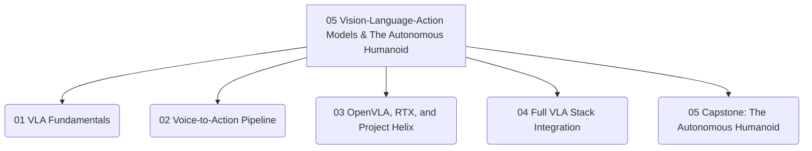

# 05 Vision-Language-Action Models & The Autonomous Humanoid

 <!-- Dramatic hero image of a VLA-powered humanoid robot in action -->

Welcome to **Module 05: Vision-Language-Action Models & The Autonomous Humanoid**! This culminating module explores the fusion of cutting-edge AI with advanced robotics, focusing on how humanoid robots achieve true autonomy by understanding and acting upon human language instructions, bridging the gap between perception, cognition, and intelligent physical action. We will delve into the foundational principles of Vision-Language-Action (VLA) models, dissect the voice-to-action pipeline, explore state-of-the-art platforms like OpenVLA on NVIDIA RTX with Project Helix, and integrate the full VLA stack to envision the future of autonomous humanoids. This module synthesizes all knowledge gained throughout the textbook, empowering you to design, implement, and deploy sophisticated, human-centric robotic applications that truly understand their world.

## Module Overview

This module covers:

* **VLA Fundamentals**: Grasping the core concepts and architectures enabling robots to interpret and act on multimodal data.
* **Voice-to-Action Pipeline**: Understanding the end-to-end process from human speech to robot execution.
* **OpenVLA, RTX, and Project Helix**: Exploring advanced frameworks and hardware accelerating VLA research and deployment.
* **Full VLA Stack Integration**: Bringing together perception, language understanding, and robot control into a cohesive system.
* **Capstone: The Autonomous Humanoid**: Synthesizing all concepts into a grand vision for fully autonomous, VLA-powered robots.

## Module Structure

## Dive into the Lessons

* [Lesson 01: VLA Fundamentals](./01-vla-fundamentals)
* [Lesson 02: Voice-to-Action Pipeline](./02-voice-to-action-pipeline)
* [Lesson 03: OpenVLA, RTX, and Project Helix](./03-openvla-rtx-and-helix)
* [Lesson 04: Full VLA Stack Integration](./04-full-vla-stack-integration)
* [Lesson 05: Capstone: The Autonomous Humanoid](./05-capstone-autonomous-humanoid)
